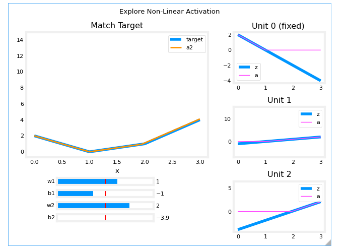
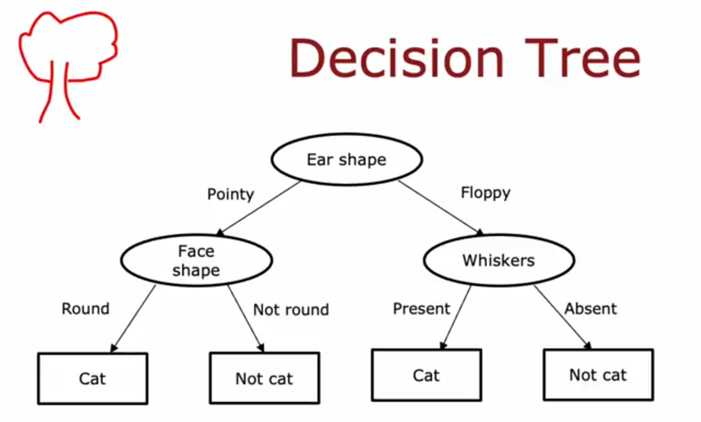

# AdvancedLearningAlgorithmsAndrewNg
Hi , the course is getting started from the neural network ,and how at each neuron it is just linear regression or logistic regression. But keep focus on the general writing of the output and input relation at each neurons.

Basic terminology :

- subscirpt j refers to the specific neuron
- superscript l refers to specific layer  
- a vector  refers to activation (output or referred as prediction in ML models)
- w refers to weights (this vector size will be equal to number of neurons in previous layer , otherwise dot product with       previous output won't be possible , think about it)
- b refers to bias (scalar for specific neurons)
Just think about the size of a and w for each layer , it will give some good insights about the architecture of the NN.

Though course is starting from TensorFlow like how to build NN with the help of this and all but first we will build with NumPy and come back to this.

## Week 01 :

Lab 01 : This lab varifies the fact that if we take single layer with one node and activation as linear or no activation so to speak, it will behave same as linear regression model,and same if activation taken as sigmoid NN will act as logistic regression function . So nothing new ,just varifies that .

Lab 02 : Building model with 3 steps
 - intial NN , model = Sequentail( some arg) : define layer ,no of nodes and activation funciton
 - The model.compile statement defines a loss function and specifies a compile optimization.
 - The model.fit statement runs gradient descent and fits the weights to the data. (to train )

 In Tensorflow training data is break down into batches (default batch size is 32) and each epoch represent one full back propogation on the entire data.

Lab 03: This lab talk about the forward progogation using numpy . so we need to calculate the activatation of each node in each layer , for classification ,sigmoid function is used for activation a= g(np.dot(w,a_pre)+ b), so this si the output of each node ,just be very careful with size of w , this will tell the number of nodes in the current layer and previous layer as well.
Each column of w represent each vector of each nodes , total columns= total nodes in that layer, since there is dot product between w and a_previous , so each vector size (ie no of rows) will tell ki previous me kitni nodes thi (previous activation layer size is no of nodes in previous layer ) . So how to calculate the correct bias and weights (training via backpropogation) that we will learn later.

## Week 02:
Lab 01 : (Relu activation) So NN , chossing correct activation function is very important , for ex classification sigmoid and you can choose separate activation function for each layer. but let say you choose linear activation function for each layer , then it will become simple linear regression problem , there is no point of NN as the end of the day the relation between input and output will look like this.
    ---------- output = (some combination of weights) * input  + (some combination of weights and  bias) ---------------------
But Relu is powerful , it can be piecewise non linear ,see the below image

if we look at the right side of the image this will tell you how in different inputs wights contribution can change to zero as function becomes negative leading to activation of that particular node to zero. and this is very powerful , you can see how non-linear output is perfectly fitted with relu as activation but can not be done with linear (no activation so to speak) activation. 
To be honest before this lab I was doubting RELU , lagg rha tha linear function jaisa hi h :).

Lab 02 : This lab talks about multilabel or multi-classfication problem , for this **Softmax** function is used which is more general form of sigmoid function and for better computation (not rounding off)by tensorflow how last function should be linear not softmax and later change linear output to the probablities using softmax function, for more refer the lab.

# Week 03
......

# Week04
 This week is all about decesion trees. Let's talk about the theory of it first.

You can see three layers in the image :
- the top is called root node.
- the second layer is called decision node.
- the third in the square where final classification is done is called leaf node.

How would you build a decision tree:
- start with all the observation at the root node.
- split the observation based on the selected root node and then further select the node and repeat the same process of splitting the observation based on the decision node until you reach the final classification (leaf node.)

I am pretty sure with above 2 point instructions, we will have no god damn idea how to build a decision tree , I mean I have a lot of questions like:
