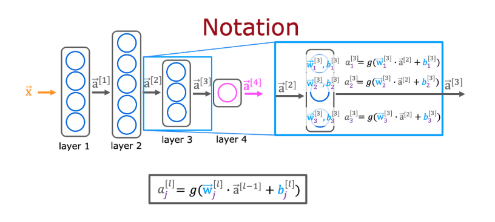

# AdvancedLearningAlgorithmsAndrewNg
Hi , the course is getting started from the neural network ,and how at each neuron it is just linear regression or logistic regression. But keep focus on the general writing of the output and input relation at each neurons.

Basic terminology :
a - activation (output or referred as prediction in ML models)

